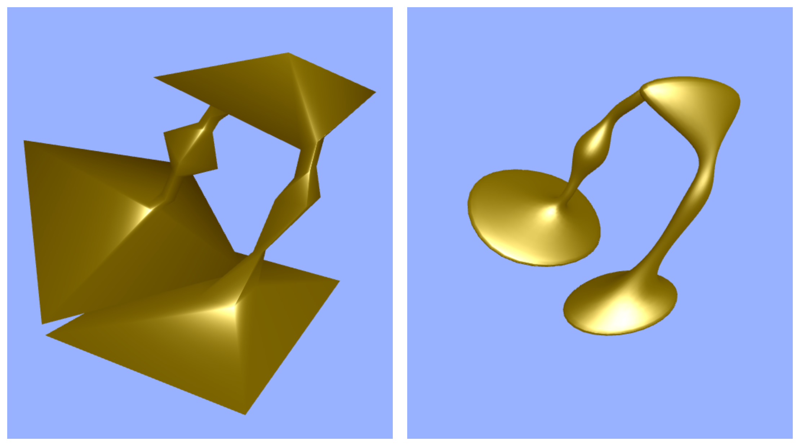
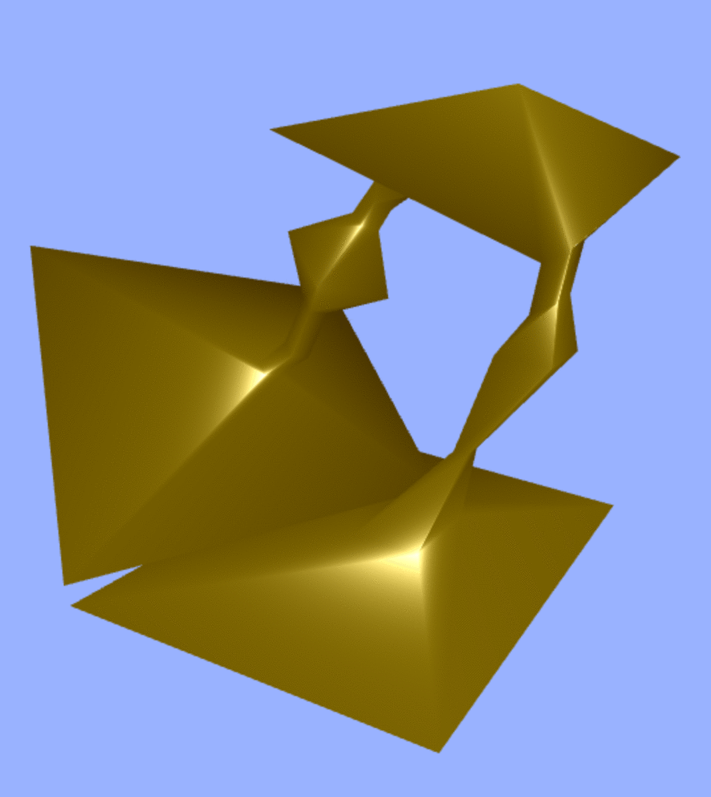

# gl-catmull-clark

This module implements the [Catmull-Clark subdivision surface algorithm](https://en.wikipedia.org/wiki/Catmull%E2%80%93Clark_subdivision_surface)
for WebGL usage. If you feed a low-poly, ugly mesh to this
algorithm, the result will be a smooth, beautiful mesh. A
[demo](http://erkaman.github.io/gl-catmull-clark/) is provided.

Below you can see what it looks like if you run the algorithm
on a low-poly mesh:

## API

### function catmullClark(positions, cells, numSubdivisions[, convertToTriangles])

Run the Catmull-Clark algorithm `numSubdivisions` times on the
mesh specified by `positions` and `cells`. **Returns** a subdivided mesh
in an object on the form  `{positions: subdividedPositions, cells: subdividedCells}`

* `positions` The vertex positions of input mesh on the form
`[  [1.0,2.0,3.0], [3.4,1.3,4.2],...]`

* `cells` The indices of the input mesh. This is either a list of
quad indices or a list of triangle indices. If quads, it is on the
form `[  [1,2,3,4], [8,9,10,11],...]`. If triangles, it is on the
form `[  [1,2,3], [8,9,10],...]`. And note that clockwise ordering of the
indices is assumed! Finally, **do note that Catmull-Clark is mostly meant to be used on meshes made with quads**
If used on triangular meshes, the quality of the subdivision is generally not as good.

* `numSubdivisions` How many times the Catmull-Clark algorithm will be
run on the input mesh. The more times you run the algorithm, the smoother
the output mesh will be.

* `convertToTriangles` The Catmull-Clark algorithm will result in a list
of quads. If this parameter is true, then those quads will be converted to
triangles, and returned. Else, the returned mesh is a list of quads. **Defaults** to `true`.

---

Below we can see what happens as we increase the value of the parameter `numSubdivisions`

